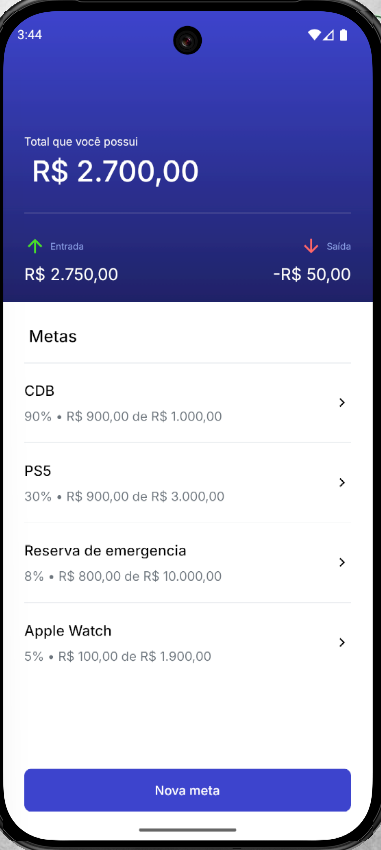

# 💰 App de Metas Financeiras

Um aplicativo mobile simples, direto e funcional para **controle financeiro pessoal com foco em metas**. Aqui não tem firula: você enxerga quanto tem, quanto entrou, quanto saiu e o progresso real de cada objetivo financeiro.

> A ideia é clara: **dinheiro com propósito**.

---

## 📱 Visão Geral

O app permite que o usuário:

* Visualize o **saldo total** disponível
* Acompanhe **entradas e saídas** de dinheiro
* Crie e acompanhe **metas financeiras personalizadas**
* Veja o **progresso percentual** de cada meta em tempo real

Tudo isso em uma interface limpa, objetiva e fácil de entender.

---

## 🧭 Tela Principal

Na tela inicial, o usuário encontra:

* **Saldo total** disponível
* **Resumo financeiro** (Entradas x Saídas)
* Lista de **metas financeiras**, como:

  * CDB
  * PS5
  * Reserva de Emergência
  * Apple Watch

Cada meta exibe:

* Valor atual economizado
* Valor total da meta
* Percentual de progresso

Há também a ação principal:

➡️ **Nova Meta**

---

## 🎯 Conceito das Metas

As metas exibidas no aplicativo (**PS5, CDB, Reserva de Emergência, Apple Watch**) são **apenas exemplos ilustrativos** usados para demonstrar o funcionamento do sistema.

No uso real, o usuário pode criar **qualquer tipo de meta**, adaptada à sua própria realidade financeira.

Cada meta representa um objetivo financeiro claro, definido pelo próprio usuário.

Exemplo ilustrativo:

* 🎮 **PS5** *(exemplo)*

  * Meta: R$ 3.000,00
  * Atual: R$ 900,00
  * Progresso: 30%

O foco do app não é o objeto da meta, mas sim:

* Clareza de objetivo
* Acompanhamento de progresso
* Disciplina financeira

Isso evita o erro clássico de "guardar dinheiro sem saber pra quê".

---

## 🧩 Diferenciais

* Interface minimalista e intuitiva
* Foco total em **clareza financeira**
* Metas visíveis e mensuráveis
* Ideal para quem quer **disciplina**, não só visual bonito

---

## 🛠️ Tecnologias Utilizadas

Este projeto foi desenvolvido com foco em simplicidade, performance local e independência de backend.

* **React Native** – construção do app mobile multiplataforma
* **SQLite** – banco de dados local para persistência offline
* **TypeScript**
* Armazenamento local e consultas diretas (sem dependência de API)

Essa escolha garante:

* Funcionamento 100% offline
* Baixa complexidade
* Maior controle sobre os dados do usuário

---

## 🚀 Objetivo do Projeto

Este app foi criado para:

* Melhorar a organização financeira pessoal
* Incentivar o hábito de poupar com objetivo
* Servir como base para futuras evoluções, como:

  * Histórico detalhado
  * Gráficos

---

## 📸 Preview

> Tela principal do aplicativo

*(print da tela anexado ao projeto)*

---

## 📌 Status do Projeto

🟢 Em desenvolvimento / funcional

---

## 📄 Licença

Este projeto é de uso livre para estudo e evolução pessoal.

---

**Menos impulso. Mais controle. Dinheiro com meta.**

## 📸 Preview

  

